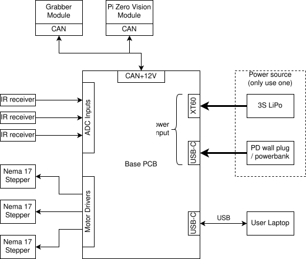
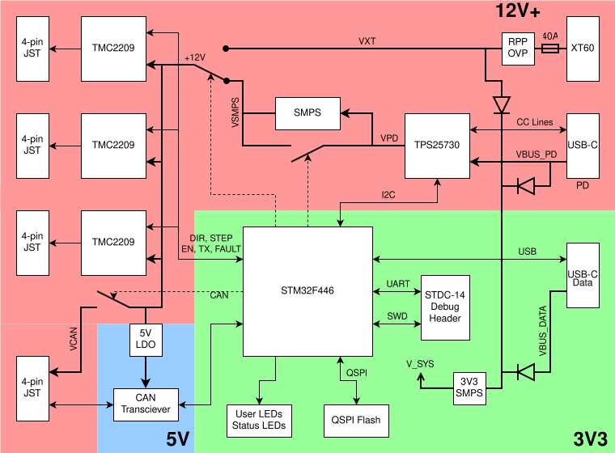

# SRO Robot Arm Kit

WIP robot arm kit for teaching.

Features:
- two arm segments and a rotating platform for 3 degrees of freedom
- microcontroller doing hardware control and running a MicroPython environment for user code
- CAN bus expansion port (e.g. for grabber and camera modules)

## Hardware

Full system block diagram:

 
Control PCB block diagram:

